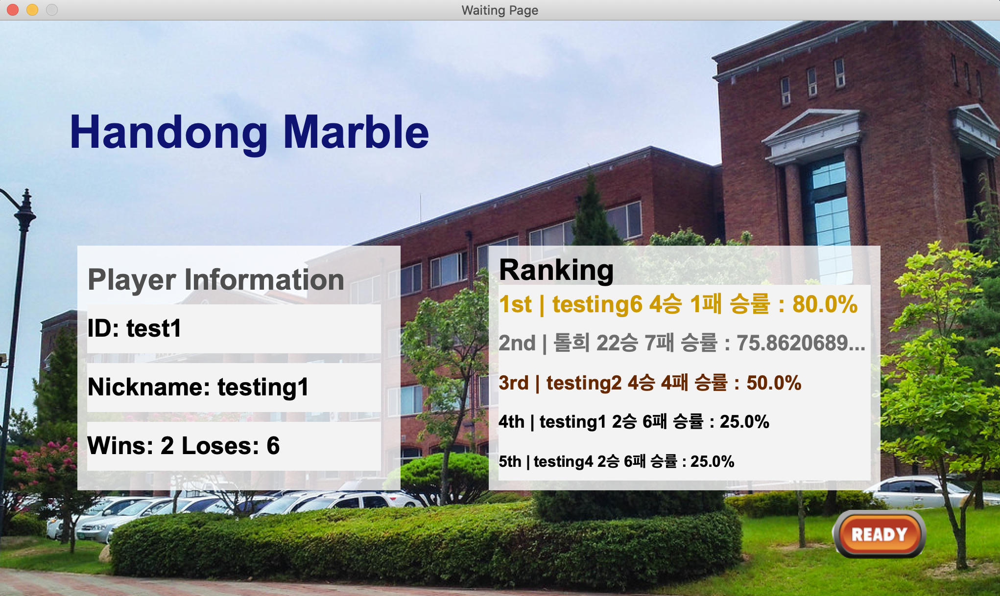

# SoftwareEngineering_Group3
조원: 박범준, 조경민, 박준혁

#HGU marble
--------------------------------------------------------------------------------


## Introduction
방가방가

<p align="left"></p>
<p align="right"></p>

### Project Summary

1) 논문 저자들이 제공한 pretrained model 파일을 활용하여 다양한 응용의 weight 등의 정보를 사용한다.

2) 각 응용에 대한 정보를 활용하기 위하여 input 영상의 size 조절, 인물 위치 등 제약조건을 만족시켜 준다.

2) User에게서 입력받은 영상을 기준으로 다양한 응용에 대한 결과 영상을 생성한다.


<br/>


## Dependencies

* [Python 3.5+](https://www.continuum.io/downloads)
* [PyTorch 0.4.0+](http://pytorch.org/)
* [TensorFlow 1.3+](https://www.tensorflow.org/) (optional for tensorboard)


<br/>


## Project contents

* 이론 설명
* 코드 설명
* 실행방법

* Project Data (Google Drive)
  - 코드
  - pretrained model
  - 데이터집합
* 프로젝트 유튜브영상 링크
  - https://youtu.be/qndhOzTewk0 (video 1)
  - https://youtu.be/W8OTKgyiabc (video 2)


<br/>


## Usage

### Step 1. Download the full file
This google share drive includes all codes and data<br/>
Available for HGU students only (access through @handong.edu account)<br/>
해당 구글 드라이브는 모든 코드와 데이터를 포함하고있습니다.<br/>
한동대학교 학생들만 접근 가능합니다. (학교 계정으로 접속해주시기 바랍니다.)
```bash
https://drive.google.com/drive/folders/14al3QKQjvuurVd-RkFSgdB8SneiFQod2?usp=sharing
```

<br/>

### Step 2. Environment setting
Download the dependencies suggested above.<br/>
위에 명시된 dependencies를 다운받아주세요. (환경설정 해주기)<br/>
(anaconda가 설치되어있는 상태를 가정함)

================== Mac ==================
1. activate 가상환경이름 - (conda 가상환경에서 설치하려면 / optional)
2. brew install wget
3. conda install pytorch torchvision -c pytorch
4. pip install tensorflow

================== Windows ==================
1. activate 가상환경이름 - (conda 가상환경에서 설치하려면 / optional)
2. conda install pytorch
3. pip install torchvision
4. pip install tensorflow

<br/>

### Step 3. Run pretrained model (test)

```bash
$ python main.py --mode test --dataset CelebA --image_size 256 --selected_attrs Black_Hair Blond_Hair Brown_Hair Male Young --model_save_dir=stargan_celeba_256/models --result_dir=stargan_celeba_256/results
```


<br/>


### * Reference
--------------------------------------------------------------------------------
본 프로젝트는 Yunjey Choi, Minje Choi1, Munyoung Kim, Jung-Woo Ha, Sunghun Kim, Jaegul Choo, "StarGAN: Unified Generative Adversarial Networks for Multi-Domain Image-to-Image Translation", arXiv:1711.09020v3 [cs.CV] 21 Sep 2018 의 논문과 그 Official implementation을 참고하여 진행하였습니다.
