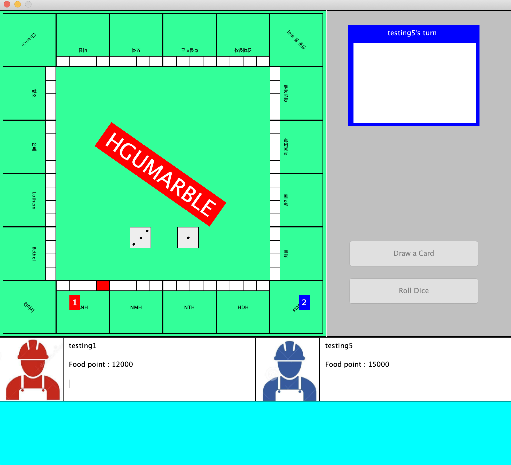

# SoftwareEngineering_Group3
조원: 김혜원, 김윤정, 이찬혁, 박준혁, 송진범

#HGU marble
--------------------------------------------------------------------------------


## Introduction
방가방가

<p align="left">
</p>

### Project Summary

1) 논문 저자들이 제공한 pretrained model 파일을 활용하여 다양한 응용의 weight 등의 정보를 사용한다.

2) 각 응용에 대한 정보를 활용하기 위하여 input 영상의 size 조절, 인물 위치 등 제약조건을 만족시켜 준다.

2) User에게서 입력받은 영상을 기준으로 다양한 응용에 대한 결과 영상을 생성한다.


<br/>


## Dependencies
* [java version "11.0.6"] 이상

<br/>


## Project contents

* 이론 설명
* 코드 설명
* 실행방법

<br/>


## Usage

### Step 1. Download the release file
You can download the whole repository for entire code.<br/>
In case of simple execution of game, just download the release file.<br/>
모든 코드를 보기 위해서는 해당 repository를 다운로드 하시고, 단순히 게임 실행을 원한다면 release 파일을 다운로드하세요.<br/>

```bash
https://github.com/pjh1023/SoftwareEngineering_Group3/tree/master/release
```

<br/>

### Step 2. Environment setting
Download the dependencies suggested above.<br/>
위에 명시된 dependencies를 다운받아주세요. (환경설정 해주기)<br/>


<br/>

### Step 3. Run HGUmarble.jar file
After downloading the release file, enter the directory of the file in cmd/terminal and do the following.<br/>
배포 파일을 다운받은 후, cmd/terminal에서 해당 디렉토리로 이동하고 다음을 실행합니다.<br/>

```bash
$ java -jar HGUmarble.jar
```


<br/>


### * Reference
--------------------------------------------------------------------------------
opensource(?)를 활용하였습니다.
